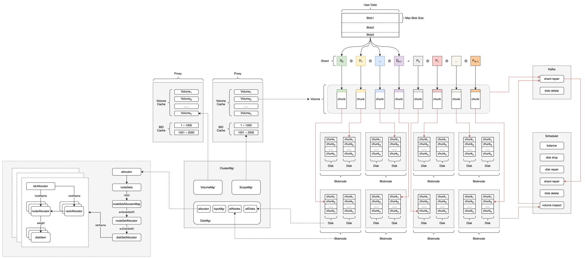
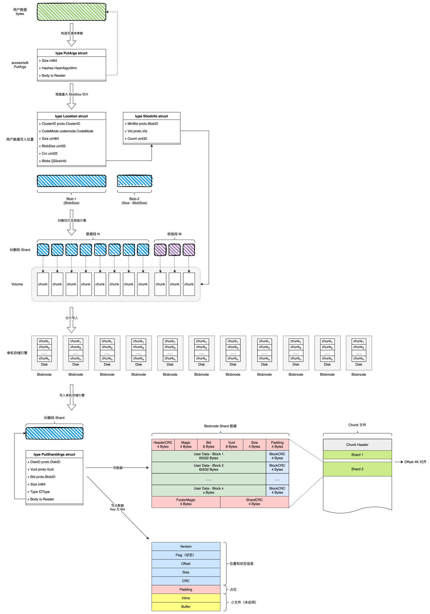

# Blobstore I/O 路径分享

## 总体架构



## 磁盘管理

### 整体架构

```plaintext
DiskMgr.refresh()                   // 刷新全集群磁盘分配器状态
├── LoadData()                      // 启动时调用，从持久化数据恢复后立即刷新
└── [Ticker] RefreshIntervalS       // 启动后台 goroutine 定期刷新
    └── dm.refresh(ctx)
```

刷新结果通过 `atomic.Value` 原子存储：

- `d.allocators[nodeRole]` -> `newAllocator(...)` 构建新的分配器，旧分配器仍可安全使用
- `d.spaceStatInfo` -> 空间统计信息

### 函数调用栈

```plaintext
DiskMgr.refresh()
│
├── 遍历 topoMgrs (每个 NodeRole 一个 topoMgr)
│   ├── 遍历 nodeSetsMap (按 DiskType 分组)
│   │   ├── 创建 nodeSetAllocator (NodeSetID)
│   │   │   └── 遍历 nodeSet 下的所有 DiskSet
│   │   │       ├── disks = diskSet.GetDisks()
│   │   │       ├── generateDiskSetStorage(disks) → idcAllocators, freeChunk
│   │   │       │   │
│   │   │       │   ├── 遍历每个 disk:
│   │   │       │   │   ├── 读取 disk/ node 的 idc/rack/host 信息
│   │   │       │   │   ├── 统计 spaceStatInfo / diskStatInfosM (磁盘状态计数)
│   │   │       │   │   └── 过滤: 非 Normal / Readonly / Expired 的 disk 不加入拓扑
│   │   │       │   │
│   │   │       │   ├── 构建拓扑层次:
│   │   │       │   │   └── idc → rack → blobNode → disk
│   │   │       │   │
│   │   │       │   ├── 统计 WritableSpace (按 CodeMode 计算)
│   │   │       │   │   └── calculateCodemodeWritable()
│   │   │       │   └── 返回 map[idc]*idcAllocator
│   │   │       │
│   │   │       └── diskSetAllocator = newDiskSetAllocator(idcAllocators)
│   │   └── nodeSetAllocators[diskType][nodeSet.ID] = nodeSetAllocator
│   ├── [compatible] 构建 EC 特有的 allocator (ecNodeSetID / ecDiskSetID)
│   │   └── 收集所有不属于任何 DiskSet 的 disk 生成 ec 分配器
│   └── d.allocators[nodeRole].Store(newAllocator(allocatorConfig{
│         nodeSets, diskSets, diffHost, diffRack
│       }))
│
└── d.spaceStatInfo.Store(spaceStatInfos)
```

### 内存拓扑结果

`refresh()` 完成后，内存中全量分配器拓扑：

```plaintext
DiskMgr.allocators[nodeRole] (atomic.Value)
│
└── allocator
    │
    ├── nodeSets[diskType] → nodeSetAllocatorMap
    │   │
    │   ├── [NodeSetID_1] → nodeSetAllocator
    │   │   ├── nodeSetID:           NodeSetID_1
    │   │   ├── freeChunk:           sum(diskSet.freeChunk)
    │   │   └── diskSets[dskSetID]:  diskSetAllocatorMap
    │   │       │
    │   │       ├── [DiskSetID_1] → diskSetAllocator
    │   │       │   ├── diskSetID:           DiskSetID_1
    │   │       │   ├── freeChunk:           idc1.freeChunk + idc2.freeChunk + ...
    │   │       │   └── idcAllocators[idc]:  map[string]*idcAllocator
    │   │       │       │
    │   │       │       ├── ["AZ-A"] → idcAllocator
    │   │       │       │   ├── idc:        "AZ-A"
    │   │       │       │   ├── freeChunk:  总空闲 chunk (该 AZ + 该 DiskSet)
    │   │       │       │   ├── diffRack:   d.RackAware
    │   │       │       │   ├── diffHost:   d.HostAware
    │   │       │       │   ├── disks:      []*diskItem (所有 disk)
    │   │       │       │   ├── blobNodeStorages:    []*blobNodeAllocator (该 AZ 内所有 Host)
    │   │       │       │   └── rackStorages[rack]:  map[string]*rackAllocator
    │   │       │       │       │
    │   │       │       │       ├── ["AZ-A-Rack1"] → rackAllocator
    │   │       │       │       │   ├── rack:             "AZ-A-Rack1"
    │   │       │       │       │   ├── freeChunk:        sum(blobNode.freeChunk)
    │   │       │       │       │   ├── blobNodeStorages: []*blobNodeAllocator
    │   │       │       │       │   │   │
    │   │       │       │       │   │   ├── Host_1 → blobNodeAllocator
    │   │       │       │       │   │   │   ├── node:      *nodeItem{idc, rack, host}
    │   │       │       │       │   │   │   ├── freeChunk: sum(disk.freeChunk)
    │   │       │       │       │   │   │   ├── free:      sum(disk.free)
    │   │       │       │       │   │   │   └── disks:     []*diskItem
    │   │       │       │       │   │   │       ├── Disk_1 → diskItem{info:{diskID, freeChunkCnt, ...}}
    │   │       │       │       │   │   │       └── Disk_2 → diskItem{...}
    │   │       │       │       │   │   │
    │   │       │       │       │   │   └── Host_2 → blobNodeAllocator{...}
    │   │       │       │       │   │
    │   │       │       │       │   └── disks: []*diskItem (同 rack 内全量 disk)
    │   │       │       │       │
    │   │       │       │       └── ["AZ-A-Rack2"] → rackAllocator{...}
    │   │       │       │
    │   │       │       └── ["AZ-B"] → idcAllocator{...}
    │   │       │
    │   │       └── [DiskSetID_2] → diskSetAllocator{...}
    │   │
    │   ├── [NodeSetID_2] → nodeSetAllocator{...}
    │   │
    │   └── [ecNodeSetID] → nodeSetAllocator
    │       └── diskSetAllocator[ecDiskSetID]
    │           └── idcAllocators["AZ-A", "AZ-B", ...]
    │
    └── [便捷查找] diskSets[diskType] → diskSetAllocatorMap

DiskMgr.spaceStatInfo  (atomic.Value)
│
└── map[nodeRole] → map[diskType] → SpaceStatInfo
    ├── TotalDisk / TotalSpace / FreeSpace / ReadOnlySpace / UsedSpace / ReservedSpace
    ├── TotalBlobNode
    ├── WritableSpace (按 max suCount 计算)
    ├── CodemodeSpaces: []CodemodeSpaceInfo (各 CodeMode 的可写空间)
    └── DisksStatInfos: []DiskStatInfo (按 IDC 统计)
        ├── IDC / Total / Available / Readonly / Expired
        └── Broken / Repairing / Repaired / Dropping / Dropped
```

### 磁盘过滤

```plaintext
generateDiskSetStorage() 遍历每个 disk:
│
├── 读取 disk.info / node.info 的 idc/rack/host (优先使用 node 信息)
│
├── 统计 diskStatInfosM[idc]:
│   ├── Total++
│   ├── TotalChunk += maxChunk
│   ├── TotalFreeChunk += originalFreeChunk
│   ├── TotalOversoldFreeChunk += max(freeChunk, oversoldFreeChunk)
│   ├── readonly → Readonly++
│   └── status → Broken/Repairing/Repaired/Dropped++
│
├── 过滤非 Normal disk:
│   └── status != DiskStatusNormal → 跳过 (不计入 allocator 拓扑)
│
├── 过滤 Readonly disk:
│   └── readonly=true → 计入 ReadOnlySpace, 跳过
│
├── 过滤 Expired disk:
│   └── isExpire() → Expired++, 跳过
│
└── 剩余 Normal && Writable && !Expired disk 加入拓扑:
    idc → rack → blobNode → disk
```

### 关键配置

| 配置项 | 默认值 | 说明 |
| --- | --- | --- |
| `RefreshIntervalS` | 300 | 刷新间隔（秒），启动后台 ticker |
| `RackAware` | False | Rack 级故障域分配时保证 Rack 分散 |
| `HostAware` | False | Host 级故障域分配时保证 Host 分散 |
| `ChunkSize` | - | chunk 大小，用于计算 writable stripe 数 |
| `IDC` | - | AZ 列表 |

## 卷创建

### 整体架构

```plaintext
VolumeMgr.loop()                                    // 主循环，仅 Leader 节点运行
│
├── [channel] v.createVolChan                       // 收到创建通知（AllocVolume 后触发）
│   ├── finishLastCreateJob()                       // 先完成上次未完成的创建任务（从 transited table 恢复）
│   └── for each codeMode                           // 按需创建
│       └── createVolume(mode)                      // 创建单卷入口
│
└── [ticker] CheckExpiredVolumeIntervalS            // 定期检查过期 volume
    └── allocator.GetExpiredVolumes()               // 找过期 Active Volume
        └── raft Propose(OperTypeExpireVolume)      // 过期后回退为 Idle
```

在 `AllocVolume` (分配 volume 给 client) 完成后，defer 中向 `createVolChan` 发信号触发创建。Leader loop 收到信号后先尝试补完 transited table 中的未完成任务，再根据 `StatAllocatable()` 统计的当前可分配量，按 `MinAllocableVolumeCount` 和 writable space 计算需要创建的 volume 数，逐卷创建。

### 函数调用栈

```plaintext
createVolume(mode)
│
├── scopeMgr.Alloc("vid", 1)                            // 1. 分配 VID (scope 递增序列)
├── Init vuInfos (N+M+L unit, epoch=MinEpoch)           // 2. 初始化 volume unit 元数据
├── raft Propose(OperTypeInitCreateVolume)              // 3. Raft 持久化到 transited table
│   └── applyInitCreateVolume()                         //    -> transitedTbl.PutVolumeAndVolumeUnit()
│
├── allocChunkForAllUnits(vol)                          // 4. 分配 chunk (核心: AZ/Rack/Host 规划)
│   └── diskMgr.AllocChunks(ctx, policy)
│       ├── availableIDC == CodeMode.T.AZCount          // 验证 AZ 数量是否满足要求
│       ├── [EC mode] allocator.Alloc()                 // (disk allocator)
│       │   ├── allocNodeSet()                          // 按 freeChunk 加权随机挑 NodeSet
│       │   ├── nodeSet.allocDiskSet()                  // 挑 DiskSet (EC mode 共用 ecNodeSetID)
│       │   ├── diskSet.alloc(countPerAZ)               // 取各 AZ 的 idcAllocator
│       │   └── idcAllocator.alloc(count, excludes)     // 每个 AZ 内部分配 disk
│       │       ├── [diffRack && diffHost]
│       │       │   └── allocFromRack()                 // 先按 freeChunk 加权选 Rack
│       │       │       └── allocFromBlobNodeOrDisk()   // 再按 freeChunk 加权选 Host
│       │       │           └── blobNode.allocDisk()    // 最终随机选 Disk
│       │       └── [else]
│       │           └── allocFromBlobNodeOrDisk()
│       └── for each disk: blobNodeClient.CreateChunk() // RPC 调用 blobnode 创建 chunk
│           └── 失败 → 递增 epoch 重试 (RetryTimes 次)
│
└── raft Propose(OperTypeCreateVolume)                  // 5. Raft 提交创建结果
    └── applyCreateVolume()                             //    -> transitedTbl.Delete + volumeTbl.Put
        └── all.putVol(vol)                             //    -> 内存中加入 shardedVolumes
```

### Chunk 分配

```plaintext
Tactic.AZCount                      // AZ 数量 (1/2/3)
│
├── GetECLayoutByAZ()               // 返回 azStripes: 每个 AZ 对应的 shard index 列表
│   └── [EC6P10L2 示例 (AZCount=2)]
│       ├── N=6,M=10,L=2                     → 每 AZ: N=3, M=5, L=1
│       ├── AZ0: [0,1,2, 6,7,8,9,10, 16]     → index 0-2 data, 6-10 parity, 16 local
│       └── AZ1: [3,4,5, 11,12,13,14,15, 17] → index 3-5 data, 11-15 parity, 17 local
│
└── [分配策略]
    ├── azStripes 随机 shuffle
    └── allocNodeSet → allocDiskSet → idcAllocators[各AZ] → idcAllocator.alloc(countPerAZ)

idcAllocator.alloc(count, excludes, isBalance)
│
├── [diffRack && diffHost] → allocFromRack()                 // Rack 感知
│   │
│   ├── 按 freeChunk 加权随机从所有 Rack 中选不同的 Rack
│   │   ├── 每个 Rack 首次只分配 1 个 shard
│   │   └── 不够时启用 duplicate 模式: 从已选 Rack 继续分配
│   │
│   └── 对每个选中 Rack:
│       └── allocFromBlobNodeOrDisk()
│           └── allocFromBlobNodeStorages()                  // Host 感知
│               ├── 按 freeChunk 加权随机选 BlobNode (Host)
│               ├── [diffHost=true] 过滤已选 Host，确保不重复
│               └── blobNodeAllocator.allocDisk()            // Disk 级别: 按 oversoldFreeChunk 加权随机选
│
└── [else] → allocFromBlobNodeOrDisk()                       // 不感知 Rack
    └── allocFromBlobNodeStorages()
        └── 按 freeChunk 加权随机选 Host → Disk
```

- azStripes 随机 shuffle 保证数据、校验分片随机分布在各个 AZ 内
- 加权随机：累加分配单元的 freeChunk，在其范围内取随机数，落在哪个单元内则从那个单元内分配

### 关键配置

| 配置项 | 作用 | 说明 |
| --- | --- | --- |
| `CodeModePolicies` | - | 启用的纠删码配置及其承载的 I/O 大小 |
| `RackAware` | False | Rack 级故障域分配时保证 Rack 分散 |
| `HostAware` | False | Host 级故障域分配时保证 Host 分散 |
| `MinAllocableVolumeCount` | 最低可分配 volume 数 | 低于此数会触发创建 |

## Put 请求处理

### 整体架构

```plaintext
Access Handler.Put()
│
├── SelectCodeMode()                              // 自动按文件大小匹配或用户指定选择 codemode
├── allocFromAllocatorWithHystrix()               // 分配 volume（Hystrix 熔断保护）
│   └── allocFromAllocator()                      // 通过 proxy 分配 volume
│       ├── ChooseOne()                           // 按策略（可用空间/轮询/随机）选集群
│       ├── proxy.VolumeAlloc()                   // 向 CM 申请 blob 资源（ID）
│       └── [filter punished volume]              // 被惩罚的 volume 加入 Excludes 重试
│
└── [for each blob in location.Spread() (并发度=4)]
    │
    ├── ec.NewBuffer(bsize)                       // 分配 EC buffer（内存池）
    ├── encoder.Split(ECDataBuf)                  // Zero-copy 切分为 N 个 data shard
    ├── io.ReadFull(reader, DataBuf)              // 从客户端读取数据
    ├── encoder.Encode(shards)                    // 生成 parity shards
    │   ├── [Standard EC]                         // Reed-Solomon: N data → M parity
    │   └── [LRC EC]                              // 全局 EC + 每个 AZ 内 local EC
    │
    └── writeToBlobnodesWithHystrix()             // 并发写 shard 到 blobnode
        └── writeToBlobnodes()
            ├── getVolume()                       // 获取 volume 物理布局
            ├── tactic.PutQuorum                  // 默认 tactic.PutQuorum
            │
            ├── [for each Unit in parallel goroutines]
            │   ├── blobnodeClient.PutShard(host, args)
            │   │   └── [HTTP POST /shard/put/diskid/{id}/vuid/{vuid}/bid/{bid}/size/{size}]
            │   │       └── [Body: shard 二进制数据]
            │   └── [重试 & 容错逻辑]
            │       ├── CodeDiskBroken / CodeVUIDReadonly → punish, 不重试
            │       ├── CodeChunkNoSpace → punish volume, discard vid
            │       ├── CodeDiskNotFound / CodeVuidNotFound → 刷新 volume 重试
            │       ├── Timeout + 未达 quorum → punish disk, 重试
            │       └── 成功 → CRC 校验
            │
            ├── [quorum 达成] 返回成功（后台 repair 异步修复失败 shard）
            ├── [AZ 全部宕机] AZCount>=3 时容忍一个 AZ 完全失败
            └── [quorum 未达成] 返回错误 → clearGarbage 清理已写数据
```

### 入口

```plaintext
func (h *Handler) Put(ctx context.Context,
                      rc io.Reader, size int64, hasherMap access.HasherMap,
                      assignClusterID proto.ClusterID, codeMode codemode.CodeMode,
) (*access.Location, error)
```

- 写入完成后更新 Location，返回给客户端，所有写入数据线程安全地写入分配的 blob slots
- 延迟清理：任何步骤失败时，会通过 `clearGarbage()` 向 proxy 发送 DeleteMsg 清理已分配但未完成的 blob

### CodeMode 选择

| 策略 | 依据 |
| --- | --- |
| 自动选择 | 遍历所有启用的 CodeMode Policy，取 `MinSize <= size <= MaxSize` 的匹配项 |
| 用户指定 | 验证模式在集群配置中已启用 |

### Volume 申请

```plaintext
allocFromAllocatorWithHystrix()
│
├── [Hystrix 熔断 (allocCommand, timeout=30s)]
│
└── allocFromAllocator()
    ├── ChooseOne()                                 // 选择目标集群
    │   ├── AlgAvailable                            // 默认按可用空间加权随机
    │   ├── AlgRoundRobin                           // 轮询
    │   └── AlgRandom                               // 纯随机
    │
    ├── proxy.VolumeAlloc(Fsize, CodeMode, BidCount)
    │   └── [向 CM 申请连续 Bid 区间，返回 AllocRet{Vid, BidStart, BidEnd}]
    ├── [过滤惩罚 volume, 被惩罚的 vid 加入 Excludes 重试]
    │
    └── [重试 retry(AllocRetryTimes=3, interval=100ms)]
        ├── 失败 → 换 proxy host 重试
        └── 成功 → cache vid→proxy 映射
```

返回 `[]access.SliceInfo` - 每个元素包含 `{Vid, MinBid, Count}`，对应一个 volume 上连续的 Bid 区间。

### EC 编码

```plaintext
[for blob in location.Spread() (并发度 4)]
│
├── ec.NewBuffer(blob.Size, tactic, memPool)
│   └── [buffer 布局]
│       ┌─────────────────────────────┬──────────┬────────────────┐
│       │           DataBuf           │   Align  │  Parity+Local  │
│       │          (RawData)          │          │  (AfterEncode) │
│       ├───────   ECDataBuf   ───────┤   Zero   │                │
│       │<-------  ECDataSize ------->│                           │
│       │<------------------------  ECSize ---------------------->│
│       └─────────────────────────────┴──────────┴────────────────┘
│
├── encoder.Split(buffer.ECDataBuf)                    // Zero-copy 切分为 N 个 data shard slice
├── io.ReadFull(limitReader, buffer.DataBuf)           // 从客户端读取 blob.Size 字节
└── encoder.Encode(shards)                             // 生成 parity shards
    ├── [Standard EC] reed-solomon: N data → M parity  // shards[0..N-1] data, shards[N..N+M-1] parity
    └── [LRC EC]
        ├── 全局 EC: N data → M parity (shards[0..N+M-1])
        └── 每个 AZ 内: group → 生成 local parity (shards[N+M..])
```

并发控制：`chan struct{}` (容量 4) 限制同时处理中的 blob 数量。

### 写入 blobnode

```plaintext
writeToBlobnodesWithHystrix()
├── Hystrix 熔断 (rwCommand, timeout=600s)  // 熔断时立即执行 callback（释放 buffer），防止内存泄漏
│
└── writeToBlobnodes()
    ├── getVolume(Cid, Vid, cache=true)
    ├── putQuorum = tactic.PutQuorum
    │
    └── for index, unit in volume.Units (并行 goroutine)
        ├── shard = shards[index] (含 data/parity/local)
        ├── crc = crc32.ChecksumIEEE(shard)
        ├── args = PutShardArgs{DiskID, Vuid, Bid, Size, Body=bytes.NewReader(shard)}
        │
        └── retry.ExponentialBackoff(PutRetryTimes=3, PutRetryIntervalMS=200)
            ├── h.blobnodeClient.PutShard(ctx, host, args)
            │   └── HTTP POST /shard/put/diskid/{diskid}/vuid/{vuid}/bid/{bid}/size/{size}
            │       └── [Body: shard 二进制, Content-Length: shard size]
            │
            ├── [成功] CRC 校验一致 → writtenNum++ (仅 data+parity shard)
            │
            ├── [CodeDiskBroken / CodeVUIDReadonly]
            │   ├── punishVolume() + punishDisk()
            │   └── 不重试
            │
            ├── [CodeChunkNoSpace]
            │   ├── punishVolume()
            │   ├── discardVidChan <- discardVid 异步丢弃 volume
            │   └── 不重试
            │
            ├── [CodeDiskNotFound / CodeVuidNotFound]
            │   ├── getVolume(Cid, Vid, cache=false) 刷新 volume
            │   ├── DiskID 变更 → 更新 Unit, 重试
            │   └── 未变更 → 不重试
            │
            ├── [Timeout] + writtenNum < putQuorum
            │   ├── punishDiskWith() 阈值惩罚
            │   └── 重试
            │
            └── [其他错误] 不重试
```

### 仲裁与容错

```plaintext
主循环等待 quorum:
│
└── for len(received) < len(volume.Units) && writtenNum < putQuorum:
    └── <-statusCh

结果
│
├── [writtenNum >= putQuorum] → 成功
│   ├── 发送信号给 repair goroutine
│   └── return nil
│
├── [AZCount >= 3 && 一个 AZ 全部宕机] → 成功
│   └── 容忍一个 AZ 完全不可用
│
└── [above both false] → 失败
    ├── close(writeDone) repair goroutine 发现 write 不存在不 repair
    └── return fmt.Errorf("quorum write failed (%d < %d)")
```

### 后台 Repair

```plaintext
quorum 达成后，启动后台 goroutine
│
├── 等待所有 shard 写完成
├── 收集失败 shard 的 index: badIdxes
└── 异步调用 sendRepairMsgBg()
    └── sendRepairMsg()
        └── proxy.SendShardRepairMsg() 通知 CM 后台修复
```

### Blobnode 写入

```plaintext
POST /shard/put/diskid/:diskid/vuid/:vuid/bid/:bid/size/:size?iotype={type}
  │
  ▼
ShardPut()
│
├── s.Disks[args.DiskID]                               // 获取对应磁盘句柄
├── ds.GetChunkStorage(args.Vuid)                      // 根据 vuid 获取 chunk 句柄
├── cs.AllowModify()                                   // 检查是否可写
├── cs.HasEnoughSpace(args.Size)                       // 检查空间是否足够
├── core.NewShardWriter(Bid, Vuid, Size, Body)         // 创建 shard 写入对象
│
├── cs.Write(ctx, shard)
│   ├── cs.consistent.Begin(b.Bid)/End()               // 写入序列化
│   ├── if cs.compacting                               // compact 时等待互斥锁
│   │   └── cs.bidlimiter.Acquire(b.Bid)
│   ├── stg := cs.GetStg()                             // 获取存储器句柄
│   │
│   ├── [A] stg.Write()                                // 普通文件路径 (size > threshold)
│   │   └── tinyfileStorage.Write()
│   │       └── stg.storage.Write()
│   │           ├── data.Write(shard)                  // -> datafile.Write()
│   │           │   ├── cd.qosAllow()                  // QoS 准入
│   │           │   ├── cd.allocSpace(phySize)         // 分配写入位置
│   │           │   ├── shard.WriterHeader(buf)        // 写入 32B Header
│   │           │   ├── encoder.Read(buf)              // 循环 CRC block 编码
│   │           │   ├── shard.WriterFooter(buf)        // 尾部写入 88 字节 Footer
│   │           │   └── ef.WriteAt(buf, pos)           // -> blobFile.WriteAt()
│   │           │       └── ioPools[Write].Submit()    // -> os.File.WriteAt()
│   │           │
│   │           └── meta.Write(bid, ShardMeta)         // -> metafile.Write()
│   │               ├── genShardKey()                  // 构建 key: "shards/{chunk_id}{bid}"
│   │               ├── value.Marshal()                // 序列化 ShardMeta (32B + inline data)
│   │               └── db.Put(kv)                     // RocksDB Put
│   │
│   └── [B] stg.Write()                                // TinyFile 路径 (size <= threshold, 默认 128KB)
│       └── tinyfileStorage.Write()
│           ├── stg.writeToMemory(shard)               // 读 body 进内存 Buffer
│           │   ├── shard.Inline = true
│           │   ├── shard.Crc = crc32(body)
│           │   └── shard.Offset = 0
│           └── stg.meta.Write(bid, ShardMeta{Inline:true, Buffer:body}) // RocksDB Put (含完整 body 数据)
│
├── ret.Crc = shard.Crc
├── cs.SyncData()             // 非 inline
│   └── stg.SyncData()        // -> stg.data.Flush()
│       └── ef.Sync()         // mergetask → os.File.Sync()
│
└── c.RespondJSON(ret)        // 返回 ShardCrc
```

### 失败清理

```plaintext
uploadSucc := false
defer func() {
    if !uploadSucc {
        h.clearGarbage(ctx, location)
    }
}()

clearGarbage()
├── 遍历 location.Spread() 中所有 blob
├── 构造 proxy.DeleteArgs
└── retry(3, 200ms)
    └── proxy.SendDeleteMsg() 向 CM 发送删除请求
```

### 数据流

```plaintext
Client              Access                Proxy                BlobNode
  │                   │                      │                    │
  │ POST /put         │                      │                    │
  │──────────────────>│                      │                    │
  │                   │                      │                    │
  │                   │ allocFromAllocator   │                    │
  │                   │─────────────────────>│                    │
  │                   │       Vid/Bid        │                    │
  │                   │<─────────────────────│                    │
  │                   │                      │                    │
  │                   │ EC Encode            │                    │
  │                   │ (Split + Encode)     │                    │
  │                   │                      │                    │
  │                   │ PutShard × N+M+L     │                    │
  │                   │──────────────────────────────────────────>│
  │                   │                      │                    │── stg.Write(data+meta)
  │                   │                      │                    │── SyncData
  │                   │                      │                    │
  │                   │ ShardCrc × N+M       │                    │
  │                   │<──────────────────────────────────────────│
  │                   │                      │                    │
  │ 200 OK + Location │                      │                    │
  │<──────────────────│                      │                    │
  │                   │                      │                    │
  │  [Failed Clear]   │                      │                    │
  │                   │ clearGarbage()       │                    │
  │                   │─────────────────────>│                    │
  │                   │ SendDeleteMsg        │                    │
  │                   │   (Kafka → Scheduler → BlobNode)          │
```

### 关键配置

| 配置项 | 默认值 | 说明 |
| --- | --- | --- |
| `PutRetryTimes` | 3 | 单 shard 写入重试次数 |
| `PutRetryIntervalMS` | 200 | 重试间隔 ms |
| `AllocRetryTimes` | 3 | volume 分配重试次数 |
| `AllocRetryIntervalMS` | 100 | 分配重试间隔 ms |
| `DiskPunishIntervalS` | 60 | 磁盘惩罚时间 s |
| `DiskTimeoutPunishIntervalS` | 未设 | 超时阈值惩罚时间 s |
| `MaxBlobSize` | 4M | 单 blob 最大大小 |
| `CodeModesPutQuorums` | - | 各 CodeMode 覆盖的写 quorum |

### 数据转换



## Get 请求处理

### 整体架构

```plaintext
Access Handler.Get()
│
├── genLocationBlobs()                     // 拆解读取计划（将 offset/size 映射到 location 中的每个 Blob 实际空间）
│   ├── ec.GetBufferSizes()                // 根据 EC 配置计算 shardSize
│   └── shardSegment()                     // 计算读 shard 时的 offset & size（跨 shard 则读取完整的 shard，否则读取部分即可）
│
├── [小读优化] getDataShardOnly()           // 只读 data shard，不做 EC 重建
│   ├── getVolume()                        // 获取 volume 布局（由哪些 disk/chunk 组成）
│   ├── ec.NewRangeBuffer()                // 根据要读取的范围构造 EC buffer
│   └── for range Unit[firstShardIdx:N]    // 逐个读取 data shard
│       └── getOneShardFromHost()          // 向 blobnode 发送 rpc 请求
│
└── [大读/EC重建] readOneBlob()
    ├── getVolume()                        // 获取 volume 布局（由哪些 disk/chunk 组成）
    ├── genSortedVuidByIDC()               // 根据 sdk/access 所在 IDC 进行排序，优先读距离更近的 shard 分片
    │                                      // 同 IDC 正常 shard > 异 IDC 正常 shard > 同 IDC 惩罚 shard > 异 IDC 惩罚 shard
    ├── shardPipe (goroutine pipeline)     // 并发去 shards
    │   ├── 首批读 minShardsRead = N + X    // 并行下发请求（当前 X 默认为 1）
    │   └── 后续逐个 shard 补充              // 失败时发起下一个
    │       └── readOneShard()
    │           ├── hystrix.Do()           // 熔断保护
    │           └── getOneShardFromHost()  // RPC 到 blobnode
    ├── [成功] 直接置换 buffer               // 满足 N 个 shard 即完成
    └── [失败] ec.ReconstructData()         // 用 N+M 中任意 N 个 shard EC 重建（reedsolomon 库）
```

### Blob 拆分

`location` 中可能包含多个 Blob（连续 Bid 区间）。`genLocationBlobs` 将 `(offset, readSize)` 映射到每个 Blob 上的实际区间：

| 字段 | 含义 |
| --- | --- |
| `ShardSize` | `ceil(BlobSize/N)` 并对齐到 `MinShardSize` |
| `ShardOffset` | 本次读取在第一个 shard 内的偏移（`blobOffset % shardSize`） |
| `ShardReadSize` | 跨 shard 的总读取字节数 |
| `Offset/ReadSize` | 对原始对象的偏移和大小 |

### 数据分片策略

在 `Get` 返回的闭包中，针对单个 Blob 场景做小读优化：

```plaintext
if len(blobs) == 1 {
    if int(blob.BlobSize) <= blob.ShardSize || blob.ReadSize < blob.BlobSize/4 {
        // 走 data shard only 路径
        err := h.getDataShardOnly(ctx, getTime, w, serviceController, blob)
        if err != errNeedReconstructRead {
            return err
        }
        // 失败则降级到 EC 重建路径
    }
}
```

触发条件（满足其一即可）：

- `BlobSize <= ShardSize`：数据只占一个 data shard，无需跨 shard
- `ReadSize < BlobSize/4`：只读取小段范围

失败降级：如果 data shard only 路径因任何错误返回 `errNeedReconstructRead`，继续走 EC 重建路径

### Data Shard Only

```plaintext
getDataShardOnly()
│
├── getVolume(Cid, Vid, cache=true)                  // 获取 VolumePhy{Units[0:N+M], CodeMode, ...}
├── ec.NewRangeBuffer(BlobSize, from, to)            // 分配仅含请求范围的 buffer（无 parity 填充）
│
├── shardOffset = blobOffset % shardSize
├── firstShardIdx = blobOffset / shardSize
│
└── for i, shard in Units[firstShardIdx : N]
    │
    ├── toReadSize = min(remainSize, shardSize - shardOffset)
    ├── RangeGetShardArgs{Offset: shardOffset, Size: toReadSize}
    ├── h.getOneShardFromHost(host, diskID, args, index, Cid, Vid, attempts=1, cancelChan=nil)
    │   └── RPC: GET /shard/get/diskid/{id}/vuid/{vuid}/bid/{bid}?iotype={type}
    │
    ├── io.ReadFull(body, buffer.DataBuf[bufOffset:])
    ├── [可选] crc32.ChecksumIEEE() 校验 CRC (ShardCrcReadEnable)
    │
    ├── 失败 → return errNeedReconstructRead (降级到 EC 路径)
    ├── shardOffset = 0 (后续 shard 从头读)
    └── remainSize -= toReadSize, bufOffset += toReadSize
```

- 只读 data shards（`Units[0:N]`），不读 parity
- 不涉及 EC 重建，数据直接写入 response

### EC 重建

```plaintext
readOneBlob()
│
├── ec.GetBufferSizes(BlobSize, tactic)                   // 计算各 shard 大小
├── emptyDataShardIndexes(sizes)                          // 找出尾部空 data shard（数据不满 N 个 shard）
│
├── genSortedVuidByIDC()                                  // 按 IDC 距离排序 shard 优先级
│   ├── distance == 0                                     // 同 IDC（最优）
│   ├── distance == 1                                     // 异 IDC（次优）
│   ├── distance == 2                                     // 同 IDC 但 disk punished
│   └── distance == 3                                     // 异 IDC 且 disk punished
│
├── minShardsRead = N + MinReadShardsX                    // 首批并行读取数量（默认 N+1）
└── shardPipe (goroutine concurrency pipeline)
    │
    ├── 第一批: sortedVuids[0 : minShardsRead]
    │   └── goroutine per shard → ch <- readOneShard()
    │
    ├── 第二批: sortedVuids[minShardsRead : ]
    │   └── 按需逐个启动（由 nextChan 触发）
    │       └── goroutine per shard → ch <- readOneShard()
    │
    └── for shard := range shardPipe (主循环，主 goroutine 消费)
        │
        ├── 慢 shard 检测: time > LogSlowTimeFator * mostTime
        │   └── 记录 warn 日志 (host, diskID, time, speed KB/s)
        │
        ├── 成功: shards[index] = buffer (置换内存池 buffer)
        ├── 失败: received[index] = false
        │
        ├── [条件] len(received) >= N + badShards:
        │   ├── shardReadSize < shardSize: 段 EC 重建
        │   │   ├── segments[idx] = shards[idx][shardOffset:shardOffset+shardReadSize]
        │   │   └── h.encoder[codeMode].ReconstructData(segments, badIdx)
        │   └── 否则: 全量 EC 重建
        │       └── h.encoder[codeMode].ReconstructData(shards, badIdx)
        │
        ├── [成功] close(stopChan) → 停止所有尚未完成的读请求
        ├── [不可恢复] badShards > M → close(stopChan), 返回 broken
        └── [等待更多] nextChan <- struct{} → 触发下一个 shard 读取
```

### 关键配置

| 参数 | 默认值 | 说明 |
| --- | --- | --- |
| `MinReadShardsX` | 1 | 首批多读 X 个 shard，减少重建概率 |
| `LogSlowBaseTimeMS` | 500 | 慢 shard 检测基准 |
| `LogSlowBaseSpeedKB` | 1024 | 慢 shard 速度基准 |
| `LogSlowTimeFator` | 2.0 | 慢 shard 时间倍数阈值 |
| `GetRetryTimes` | 3 | 单 shard 读取重试次数 |
| `GetRetryIntervalMS` | 200 | 重试间隔 ms |

## Del 请求处理

### 整体架构

```plaintext
Access Handler.Delete()
│
└── clearGarbage()
    ├── location.Spread()
    ├── proxy.DeleteArgs{ClusterID, Blobs}
    └── retry(3, 200ms)
        └── proxy.SendDeleteMsg()
              │
              ▼
        Proxy SendDeleteMessage
        ├── 校验 ClusterID
        ├── 生成 proto.DeleteMsg
        └── 批量发送到 Kafka topic
              │
              ▼
        Scheduler BlobDeleteMgr.Consume
        ├── 检查重试惩罚 / 安全延迟 / 故障磁盘
        └── deleteBlob()
            │
            ├── Phase 1: markDelBlob
            │   └── deleteShards(markDelete=true)
            │       └── for each vunit (并发)
            │           └── blobnode.MarkDelete()
            │               └── POST /shard/markdelete/...
            │
            └── Phase 2: delBlob
                └── deleteShards(markDelete=false)
                    └── for each vunit (并发)
                        └── blobnode.Delete()
                            └── POST /shard/delete/...
                                  │
                                  ▼
                            Blobnode ShardMarkdelete / ShardDelete
                            ├── QPS 限流 (per-key=1, per-disk=128)
                            ├── QoS: IOTypeDel
                            ├── cs.AllowModify()
                            │
                            ├── MarkDelete: 仅改元数据标记
                            │   └── stg.MarkDelete()
                            │       ├── meta.Read(bid)
                            │       ├── Flag = ShardStatusMarkDelete
                            │       └── meta.Write(bid, shard)
                            │
                            └── Delete: 删除元数据 + 数据
                                └── stg.Delete()
                                    ├── meta.Read(bid)
                                    ├── 验证 Flag == MarkDelete
                                    ├── meta.Delete(bid) [KV 删除]
                                    └── [非 Inline] data.Delete(shard)
                                        └── fallocate(PUNCH_HOLE)
```

### 数据流

```plaintext
Client              Access              Proxy              Kafka              Scheduler           Blobnode
  │                   │                  │                  │                  │                   │
  │ POST /delete      │                  │                  │                  │                   │
  │──────────────────>│                  │                  │                  │                   │
  │                   │                  │                  │                  │                   │
  │                   │ clearGarbage()   │                  │                  │                   │
  │                   │─────────────────>│                  │                  │                   │
  │                   │ POST /deletemsg  │                  │                  │                   │
  │                   │                  │                  │                  │                   │
  │                   │                  │ SendMessages()   │                  │                   │
  │                   │                  │─────────────────>│                  │                   │
  │                   │                  │                  │                  │                   │
  │                   │                  │                  │ Consume()        │                   │
  │                   │                  │                  │─────────────────>│                   │
  │ 200 OK            │                  │                  │                  │                   │
  │<──────────────────│                  │                  │                  │                   │
  │                   │                  │                  │                  │                   │
  │                   │                  │                  │                  │ Phase 1:          │
  │                   │                  │                  │                  │ MarkDelete        │
  │                   │                  │                  │                  │──────────────────>│
  │                   │                  │                  │                  │ POST /markdelete  │
  │                   │                  │                  │                  │                   │
  │                   │                  │                  │                  │                   │── meta.Write(Flag=MarkDelete)
  │                   │                  │                  │                  │                   │
  │                   │                  │                  │                  │ Phase 2:          │
  │                   │                  │                  │                  │ Delete            │
  │                   │                  │                  │                  │──────────────────>│
  │                   │                  │                  │                  │ POST /delete      │
  │                   │                  │                  │                  │                   │
  │                   │                  │                  │                  │                   │── meta.Delete (RocksDB)
  │                   │                  │                  │                  │                   │── data.Delete (PUNCH_HOLE)
```

### 关键特性

- 异步删除：Access/SDK 不等待实际删除完成，只确认消息写入 Kafka
- 两阶段删除：先 MarkDelete 标记（1 阶段），再实际 Delete（2 阶段），防止数据误删
- 幂等性：MarkDelete 和 Delete 可在任意阶段重试，不会重复执行
- QPS 限流：每 bid 并发 = 1，每 disk 并发 = 128，避免删除风暴
- 重试机制：失败消息进入 fail 队列，逐步递增 retry 计数
- 安全延迟：删除消息消费后等待 SafeDelayTimeH 确保数据可恢复
